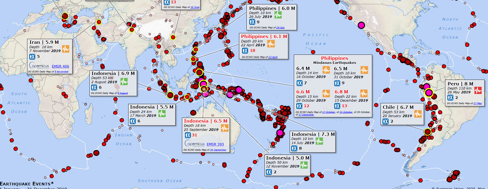
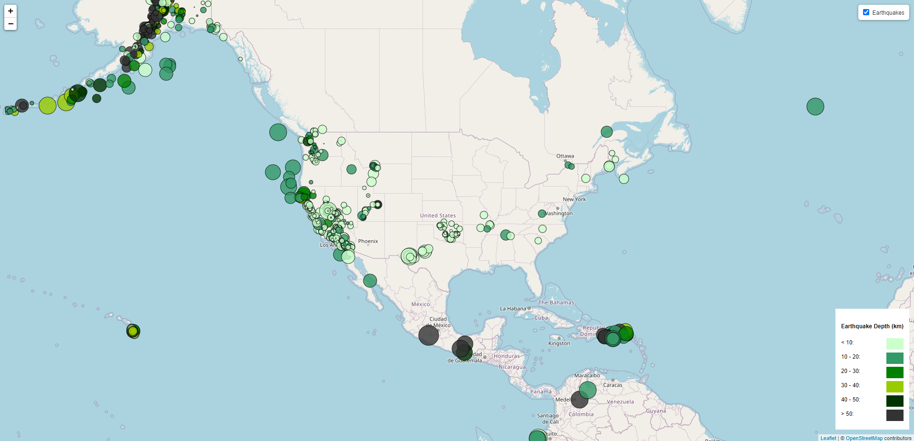
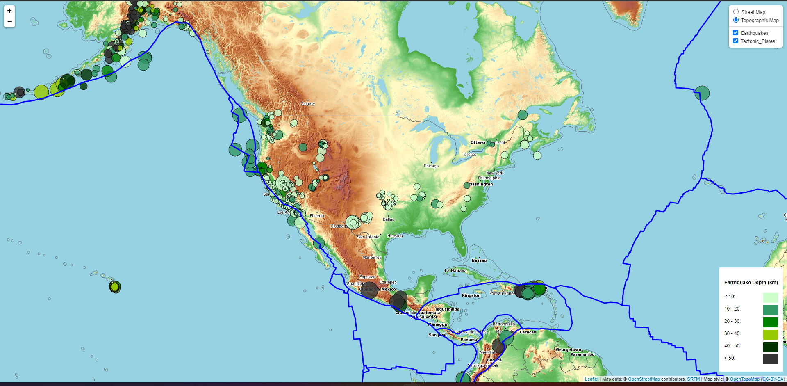

# Leaflet-challenge

Visualizing Data with Leaflet  for Earthquake Visualization
## Level 1: Earthquakes Basic Visualization
I used USGS GeoJSON Feed to get the data and visualized all Earthquakes from the Past 7 Days.

* The map is created using Leaflet, which plots all earthquakes from the data set based on their longitude and latitude.
* Data markers are also used to reflect the earthquake's magnitude in their size and color. Earthquakes with higher magnitudes should appear more significant in the color spectrum, starting from green to red, which means when magnitude increases, the color goes from green to red.
Popups are included to provide additional information about the earthquake when a marker is clicked
* legend added to give the context of the map data.
* The map looks as:

